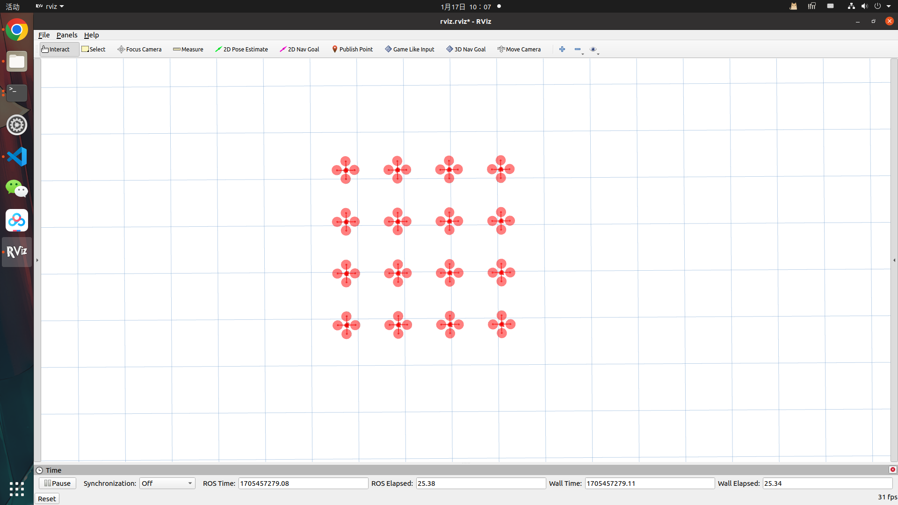
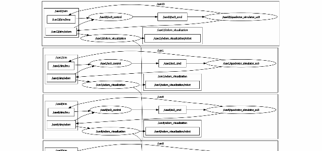
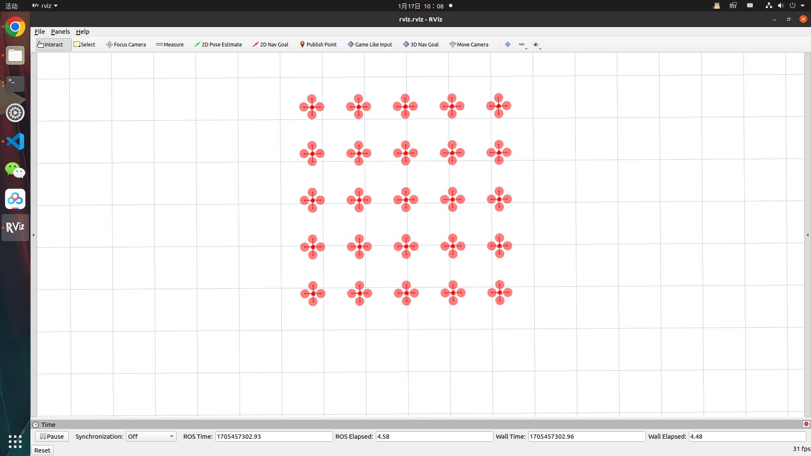
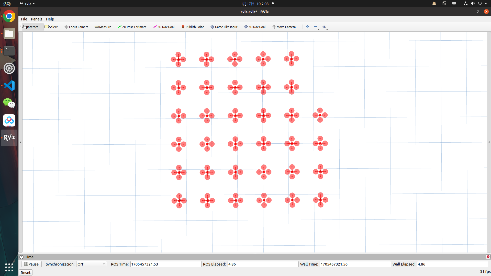
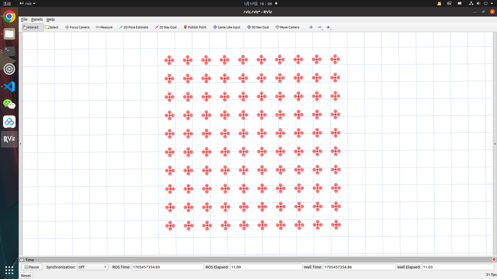
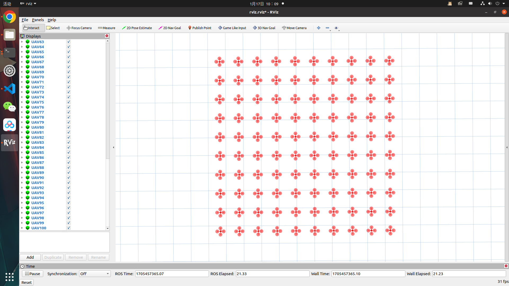

# Swarm Simulator
A simulator desigened for quadrotor swarm motion planning methods. If you have any questions, please ask in the "issues" section.

# Description
This repository mainly contains the following modules: 

(1) ```uav_simulator```:Quadrotor swarm simulator. 


# Compile
__Tested environment__: Ubuntu 20.04 + ROS Noetic

1.Download and compile the repo

```
mkdir -p water_swarm_ws/src
cd water_swarm_ws/src
git clone https://github.com/SmartGroupSystems/Swarm-Simulator.git
cd ..
catkin_make
```

2.Test

```
cd water_swarm_ws/
source devel/setup.bash
cd src/Swarm-Simulator
./multi_quadrotor_simulator.sh 16
```

Then you can see a uav swarm like this:


Every uav has it's own control loop, you can use ```rqt_graph``` to see the framework.



If you want to change the number of the uav, just change like this:
```
./multi_quadrotor_simulator.sh 25
./multi_quadrotor_simulator.sh 34
./multi_quadrotor_simulator.sh 100
```
Then you can see a swarm like this:





Note that in ```RVIZ``` we only display 100 uav. If you want to add more, please add the display module in ```RVIZ```

